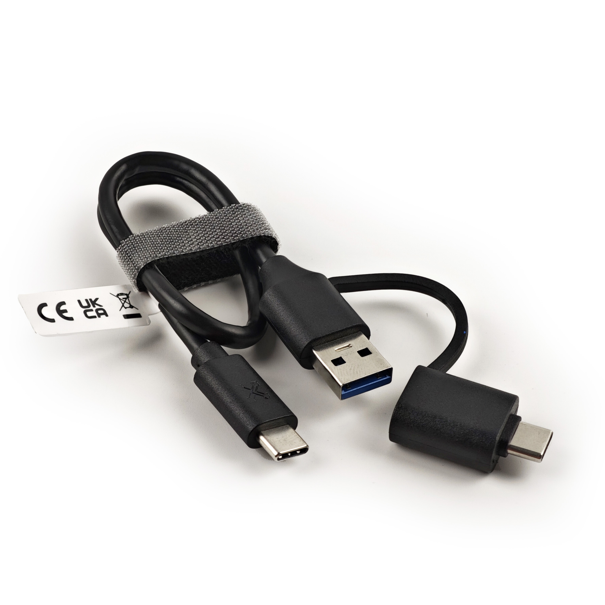

# Zubehör

Hier finden Sie verschiedene Produkte, die die Funktionalität des Openterface Mini-KVM ergänzen und verbessern. Wir bieten eine Reihe von Zubehörteilen an, die Ihre Erfahrung mit unserem Mini-KVM noch vielseitiger und bequemer machen.

## VGA-zu-HDMI-Konverterkabel

{:style="height:360px"}

Dieses Produkt wandelt VGA-Video und integriert Audio in HDMI, wodurch eine einfache Verbindung von VGA-Geräten zu HDMI-Displays ermöglicht wird.

- **Modell**: CABLE100-VGA2HDMI
- **Länge**: 1M
- **Ausgabe Videoauflösung**: 1920x1080P Full HD
- **Eingang Audio**: 3,5mm Audioanschluss
- **Audioausgabe**: über HDMI
- **Stromversorgung**: Stromversorgung über USB

### Anwendungsfall
Für einen detaillierten Anwendungsfall dieses Kabels besuchen Sie bitte [Vereinfachtes Servermanagement](/use-cases/#streamlined-server-management).

### Demo-Video
Sehen Sie sich das Demo-Video des Tech-Influencers **Cameron Gray** an, wie man dieses Kabel mit dem Mini-KVM verwendet: [Dieses USB-KVM-Konsolengerät ist großartig!](https://youtu.be/xAEQpWyfY-c?si=auB5NtqHVw2C7iIK&t=1693)

<button class="md-button" onclick="window.location.href='https://www.crowdsupply.com/techxartisan/openterface-mini-kvm#products'">Bestellung aufgeben</button>

---

## Type-C-zu-USB-A-Kabel mit Adapter

{:style="height:360px"}

Dieses vielseitige Type-C-Male-zu-USB-A-Male-Kabel, gepaart mit einem USB-A-Female-zu-USB-C-Male-Adapter, bietet flexible Konnektivität zu Zielgeräten. Es ermöglicht die Datenübertragung und die Übertragung von Tastatur- und Maussteuerungssignalen, unabhängig davon, ob das Zielgerät einen USB-A- oder Type-C-Anschluss verwendet.

- **Länge**: 0,3m
- **Farbe**: Schwarz
- **Adapter**: USB-A-Female-zu-USB-C-Male
- **Verwendung**: Ermöglicht einfache Steuerung und Datenübertragung zum Zielgerät.

---

## Type-C-zu-Type-C-Kabel mit Adapter

{:style="height:360px"}

Dieses stilvolle und weiche Type-C-Male-zu-Male-Kabel in leuchtendem Orange ist für Verbindungen zu Host-Computern konzipiert. Es wird mit einem USB-C-Female-zu-USB-A-Male-Adapter für erweiterte Kompatibilität geliefert, sodass Sie sich mit Host-Computern verbinden können, die entweder Type-C- oder USB-A-Anschlüsse verwenden. Darüber hinaus unterstützt dieses Kabel **240W Schnellladung** (Spannung DC50V, Strom 5A, Leistung 240W), was es nicht nur perfekt für unsere Mini-KVMs, sondern auch zum Aufladen Ihres Mobiltelefons oder Laptops macht.

- **Länge**: 1,5m
- **Farbe**: Orange
- **Adapter**: USB-C-Female-zu-USB-A-Male
- **Verwendung**: Für Hochgeschwindigkeits-Datenübertragung zwischen dem Host-Computer und dem Mini-KVM sowie zum Schnellladen von Mobiltelefonen oder Laptops.

---

## HDMI-Male-zu-Male-Kabel

{:style="height:360px"}

Dieses kompakte HDMI-Kabel ist perfekt, um Ihr Zielgerät anzuschließen und Videoausgaben zu erfassen, was eine nahtlose Integration mit Ihrem Openterface Mini-KVM gewährleistet.

- **Länge**: 0,3m
- **Farbe**: Schwarz
- **Verwendung**: Ideal für die Übertragung von hochauflösendem Video vom Zielgerät zum Mini-KVM.

---

## Openterface Werkzeugtasche

{:style="height:360px"}

Halten Sie Ihr Openterface Mini-KVM und dessen Zubehör organisiert und tragbar mit dieser kompakten Werkzeugtasche. Mit einem stilvollen orangefarbenen Reißverschluss und dehnbaren Netzfächern sorgt diese Tasche für hervorragendes Kabelmanagement und einfache Transportmöglichkeiten, perfekt für IT-Profis unterwegs.

- **Abmessungen**: 180 x 115 x 50mm
- **Farbe**: Schwarz mit orangefarbenem Reißverschluss
- **Verwendung**: Ideal zum Aufbewahren und Organisieren Ihres Mini-KVM und dessen Kabel.

---

## Erweiterungskappen

{:style="height:360px"}

Diese 3D-gedruckte Erweiterungskappe ersetzt die Originalkappe des Openterface Mini-KVM und ermöglicht fortgeschrittenen Benutzern den Zugriff auf Erweiterungspins für die individuelle Entwicklung. Sie können die 3D-Modell-Dateien aus unserem GitHub-Repository herunterladen und die Kappe selbst drucken.

- **Verwendung**: Bietet Zugriff auf Erweiterungspins für fortgeschrittene Hardwareentwicklung.
- **Download**: [3D-Modell-Dateien](https://github.com/TechxArtisanStudio/Openterface_Mini-KVM_Hardware/tree/main/models)

---

## Mehr demnächst

Bleiben Sie dran für weitere Zubehörteile, die in diesem Abschnitt hinzugefügt werden und Ihre Erfahrung mit dem Openterface Mini-KVM verbessern.