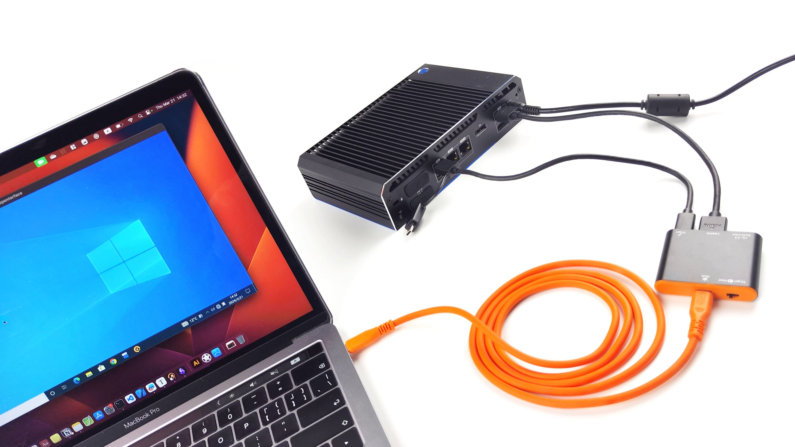

# Grundlegende Steuerung

## 💻 Kompatibilität

- **Host-Software**: Installiere unsere [Host-App](/app) für macOS, Windows und Linux, um deine Zielgeräte zu steuern. Stelle sicher, dass dein Host-System mit der entsprechenden App-Version kompatibel ist.
- **Kompatibilität des Zielgeräts**: Auf dem Zielgerät ist keine Vorinstallation oder Konfiguration erforderlich. Solange das Zielgerät UI-Operationen mit Videoausgabe (z.B. HDMI, VGA) unterstützt und über einen USB-Anschluss verfügt, um emulierte Tastatur- und Maussteuerungssignale (HID) zu empfangen, kann es verwendet werden. Unterstützte Zielplattformen sind Windows, macOS, Linux, Android und iOS.

## 🖱 Maussteuerung

- **Absoluter Modus**: Der Mauszeiger des Zielgeräts wird direkt auf eine bestimmte Position auf dem Bildschirm des Hosts über unsere App abgebildet. Das bedeutet, dass der Mauszeiger des Zielgeräts den Bewegungen der Host-Maus innerhalb unserer App folgt. Beachte, dass es zu einer leichten Verzögerung der Cursorbewegungen kommen kann. Du kannst wählen, ob der Mauszeiger des Hosts in unserer App angezeigt oder ausgeblendet werden soll.

- **Relativer Modus**: Die Mausbewegung des Zielgeräts ist relativ zur aktuellen Position der Host-Maus. Das bedeutet, dass die Bewegung der Host-Maus den Cursor des Zielgeräts um eine bestimmte Strecke in die gleiche Richtung verschiebt, ohne einen festen Start- oder Endpunkt. Du kannst diesen relativen Modus mit einer bestimmten Tastenkombination verlassen.

## ⌨️ Tastatur

Wenn die App im Fokus ist, kannst du direkt tippen, und diese Tastenanschläge werden an den Computer des Zielgeräts weitergeleitet.

## ⚙️ BIOS-Zugriff

- **BIOS-Zugriff**: Verwende unsere App, um auf das BIOS deiner Zielgeräte zuzugreifen. Dies ermöglicht es dir, Einstellungen direkt im BIOS zu steuern und zu konfigurieren.

??? tip "Tastenanschläge zum Aufrufen des BIOS für verschiedene Motherboards"

    - F2: Dell, Lenovo, ASUS, Acer, Toshiba, Samsung, Sony
    - F1: Lenovo
    - Entf: ASUS, Acer, Gigabyte, MSI
    - F10: HP
    - Assist-Taste: Sony
    - Option (⌥) Taste: Apple (um den Startmanager aufzurufen)

## 🔊 Ton

- **Audioübertragung**: Der Ton des Zielcomputers wird über den HDMI-Eingangsport des Mini-KVM übertragen. Wenn du unsere App verwendest, wird der Ton des Zielcomputers über den Host-Computer abgespielt, sodass du alles nahtlos hörst.

## 🎥 Video

- **Videowiedergabe**: Unsere App ermöglicht es dir, den Bildschirm des Zielcomputers nahtlos anzuzeigen. Sie unterstützt Videoauflösungen bis zu 1920x1080 bei 30Hz für die Anzeige innerhalb der App. Der maximale Videoeingang, der unterstützt wird, beträgt bis zu 3840x2160 bei 30Hz über HDMI. Zusätzlich kann mit einem Adapter auch VGA, Micro HDMI, DVI und andere Videoeingangsquellen verwendet werden.

## 🔄 Umschaltbarer USB-Anschluss

- **Verwendung des USB-Anschlusses**: Das Mini-KVM verfügt über einen umschaltbaren USB-A 2.0-Anschluss, der zwischen dem Host- und den Zielcomputern umgeschaltet werden kann, jedoch nicht gleichzeitig.
- **Umschaltmethoden**: 
    - Hardware-Schalter: Ein physischer Schalter am Gerät
    - Software-Schalter: Eine Schaltfläche in der Host-Anwendung
- **Umschaltlogik**: Für detailliertere Informationen zur Logik des umschaltbaren USB-Anschlusses, einschließlich der Interaktion zwischen Hardware- und Software-Schaltern, der Ersteinrichtung, Betriebszuständen und Zustandsübergängen, siehe die [USB-Schalter-Dokumentation](usb-switch.md).

!!! warning "Wichtig"
    - Denke daran, alle angeschlossenen USB-Laufwerke auszuwerfen, bevor du die Verbindung des Anschlusses umschaltest.
    - Der USB-Anschluss hat Leistungsbeschränkungen. Schließe keine Geräte an, die viel Strom benötigen, da dies zu instabilem Betrieb oder möglichen Schäden führen kann.
