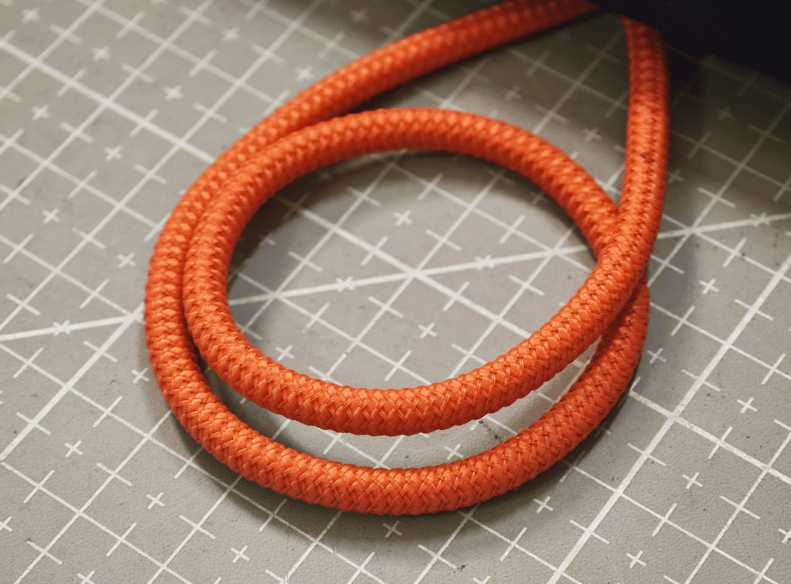

# Die Lieferung ist unterwegs! Zusätzliche Kabel für das Toolkit hinzugefügt. Was kommt als Nächstes?

Hallo, Openterface-Community!

Wir freuen uns, Ihnen mitteilen zu können, dass unsere Openterface-Produkte offiziell versandt wurden. Sie befinden sich derzeit im Hafen von Shenzhen und warten darauf, an Bord eines Frachtschiffs in Richtung USA zu gehen!

  

Hier sind die Neuigkeiten:

## Vorbereitung der Auslieferung: Qualitätskontrollen und Verpackung

Vor dem Verpacken und Versenden haben wir jede Einheit gründlich getestet, um die höchste Qualität sicherzustellen, wie in einem früheren Update erwähnt: [DIY-Challenge, tolle Preise und die Produktion geht in die Endphase!](https://www.crowdsupply.com/techxartisan/openterface-mini-kvm/updates/diy-challenge-cool-prizes-and-production-nears-the-finish-line). Jedes Kabel wurde mit unserem Mini-KVM auf Signalübertragungsstabilität geprüft.

Nun zu den Neuigkeiten – sowohl die schlechten als auch die guten.

### Schlechte Nachrichten: Einige orangefarbene Kabel entsprachen unter schwierigen Bedingungen nicht den Erwartungen

Unser Mini-KVM überträgt Video, Audio, Maus-/Tastatursteuerung und USB-Daten über ein einziges Typ-C-Kabel. Die Leistung des Kabels ist entscheidend für die Datenstabilität, insbesondere in herausfordernden Umgebungen.

Um reale Störungen zu simulieren, wickelten wir das orangefarbene Typ-C-Kabel um einen Elektromotor eines Ventilators, während mehrere Computer in der Nähe liefen. So wurde ein hohes Maß an elektromagnetischen Störungen (EMI) erzeugt, um die Stabilität der Datenübertragung unserer Kabel zu bewerten.

  
*Eine kostengünstige, aber effektive Testmethode.*

Sehen Sie sich unseren [Video-Tweet](https://x.com/TechxArtisan/status/1856559677296816347) an, um einen unserer Leistungstests im Vergleich zu sehen.

Unter diesen Bedingungen zeigten einige orangefarbene Kabel Signalverluste, was Zweifel an ihrer Zuverlässigkeit in komplexen Umgebungen wie Rechenzentren oder bei kritischen IT-Operationen aufkommen ließ.

Um dieses Problem zu lösen, hat unser Technischer Direktor Kevin Peng ein maßgeschneidertes Testprogramm entwickelt. Mit diesem Tool können Sie die Qualität Ihrer eigenen USB-Kabel testen. Es wird bald als Open Source verfügbar sein – weitere Updates folgen.

  
*Mit unserem Programm wird das Kabeltesten zum Kinderspiel.*

Während unsere orangefarbenen Kabel mit ihrer weichen, silikonähnlichen Textur und ihrem attraktiven Aussehen ideal für den täglichen Gebrauch wie Schnellladen und reguläre Datenübertragungen sind, stoßen sie bei intensiven Übertragungsarbeiten in schwierigen Bedingungen wie starker EMI an ihre Grenzen.

### Gute Nachrichten: Unsere Lösung ist da

Wir haben umgehend hochwertige Nylon-USB-3.2-Kabel beschafft, die im Toolkit kostenlos enthalten sind. Diese langlebigen Kabel sind in drei Längen in der Farbe Grau erhältlich: *1 m (3,2 ft)*, *1,5 m (4,9 ft)* und *2 m (6,5 ft)*. Sie erhalten eines dieser Kabel zufällig ausgewählt in Ihrer Toolkit-Version, um eine robuste und zuverlässige Verbindung für Ihr Mini-KVM sicherzustellen.

In zukünftigen Mini-KVM-Toolkit-Versionen wird das orangefarbene Kabel für die Verbindung mit der Hostseite des Mini-KVM durch das Nylon-Typ-C-3.2-Kabel ersetzt, das Funktionalität, Stabilität und Stil vereint.

Wir hoffen, dass Sie diese Entscheidung begrüßen und auch weiterhin in kritischen Momenten an der Technologiefront auf Openterface vertrauen.

## Versandplan

Wann können Sie Ihr Mini-KVM erwarten?  
Wenn alles planmäßig verläuft, sollten unsere Produkte bis Mitte Dezember im **Mouser-Lager von Crowd Supply** ankommen. Danach werden die Bestellungen entsprechend verschickt.

- **Für Unterstützer in den USA**: Es besteht eine geringe Chance, dass die Lieferung vor Weihnachten erfolgt, dies ist jedoch nicht garantiert, da die Logistik näher an den Feiertagen langsamer wird.
- **Für Unterstützer außerhalb der USA**: Die Lieferzeiten variieren je nach Region. Unsere beste Schätzung ist Mitte Januar.

Wir hoffen auf eine reibungslose Reise für unsere Openterface-Produkte – ohne Seekrankheit, Reisekrankheit oder Jetlag! 😃

## Coole Openterface-T-Shirts und Hoodies

Am kommenden Wochenende (16.–17. November) sind wir auf der Maker Faire in Shenzhen. Um uns vorzubereiten, haben wir Team-Bekleidung entworfen, darunter T-Shirts, Zip-Hoodies und Pullover-Hoodies.

Werfen Sie einen Blick darauf und lassen Sie uns wissen, was Sie davon halten:  

## Unterstützen Sie unsere Entwicklung

Wenn Sie unsere Open-Source-Entwicklung weiter unterstützen möchten, besuchen Sie unseren [TechxArtisan Shop](https://shop.techxartisan.com/). Dort können Sie Kabel, T-Shirts und Hoodies kaufen – und damit unsere Innovationsarbeit finanziell unterstützen. Jeder Kauf zählt und stärkt den Geist der Open-Source-Community.

## Was kommt als Nächstes: Host-App-Updates

Da der Versand jetzt läuft, liegt unser Fokus wieder darauf, unsere Host-Apps zu verbessern. Wir arbeiten daran, diese in verschiedenen App-Stores zertifizieren zu lassen, um Ihnen eine nahtlose Erfahrung mit Openterface zu bieten.

## Was kommt als Nächstes: Machen Sie mit beim USB-DIY-Wettbewerb

Warum nehmen Sie nicht an unserem **USB KVM DIY Challenge 2024** teil, sobald Sie Ihr Openterface Mini-KVM in den Händen halten? Es ist eine großartige Gelegenheit, zur Open-Source-Entwicklung beizutragen und tolle Preise zu gewinnen – darunter zwei Sondereditionen des Openterface Mini-KVM und vieles mehr! Weitere Details finden Sie auf der [Wettbewerbsseite von Crowd Supply](https://www.crowdsupply.com/techxartisan/usb-kvm-diy-challenge-2024).

  

## Zusammenfassung

Vielen Dank, dass Sie ein integraler Bestandteil unserer Reise sind. Ihre Unterstützung und Ihr Feedback treiben uns voran. Wenn Sie Fragen oder Ideen haben, freuen wir uns darauf, von Ihnen zu hören! Treten Sie der Unterhaltung in unserer Community bei: auf [Reddit](https://openterface.com/reddit) und [Discord](https://openterface.com/discord).

Mit Dankbarkeit,  
**Billy Wang**  
Produktmanager  
Openterface-Team | TechxArtisan
