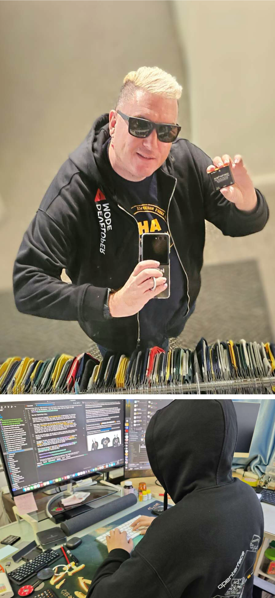
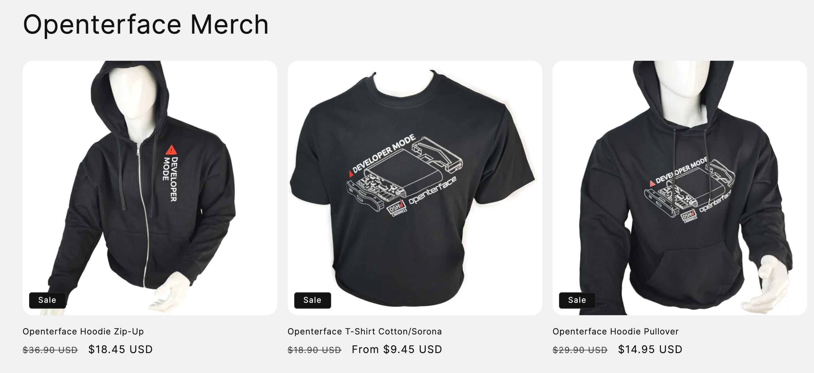
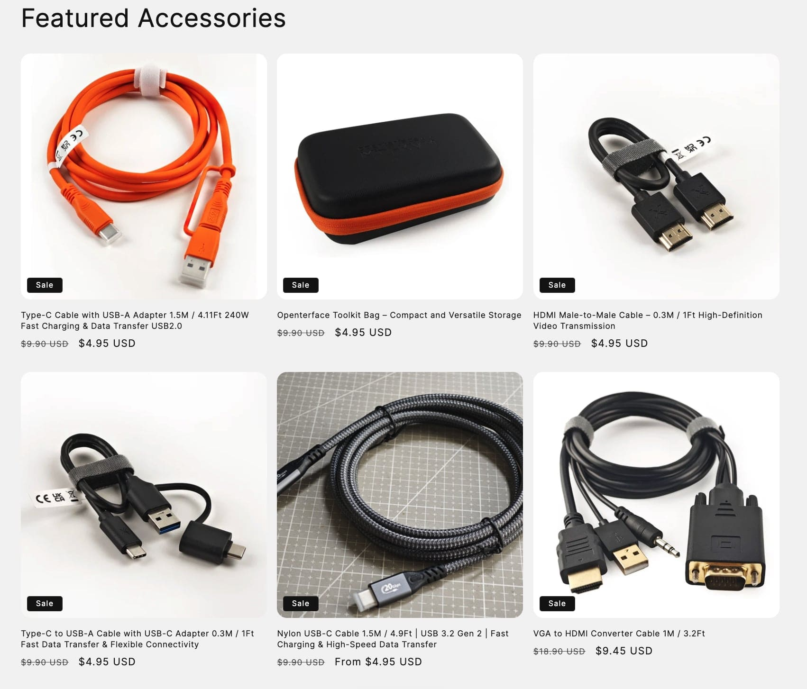

# 50% RABATT auf ALLE Artikel – Nur an diesem Black Friday! Unterstütze Open Source!

Hallo liebe Openterface-Community,

Großartige Neuigkeiten – wir haben **eine neue Bekleidungskollektion** bei Openterface herausgebracht! Unsere Kollektion umfasst T-Shirts und Hoodies, die den Geist unserer Gemeinschaft verkörpern. Es sind nicht nur Kleidungsstücke; sie feiern unsere gemeinsamen Werte und die Openterface-Philosophie.

Was macht diese Designs so besonders? Sowohl das T-Shirt als auch der Hoodie zeigen stolz die **technischen Linienzeichnungen unseres Openterface Mini-KVM**, das einfach unglaublich cool aussieht. Außerdem haben wir in den Designs den Text **„Developer Mode“** unseres Mini-KVM hervorgehoben – eine Idee, die wir absolut genial finden. Wenn du unser T-Shirt oder unseren Hoodie trägst, geht es nicht nur darum, diesen Winter warm zu bleiben; es geht darum, in den Super-Developer-Modus für all deine Coding- und Hacking-Sessions einzutauchen.

Und wenn du dich fragst, wie diese Teile in der Realität aussehen, schau dir an, wie unser Team sie in Aktion trägt! Vom gemütlichen **Developer Mode** beim Programmieren ([siehe Tweet](https://x.com/TechxArtisan/status/1861611266705379346)) bis hin zu einem lustigen Fotoshooting mit David Groom vom **MAKE: Magazin** auf der Shenzhen Maker Faire ([Foto ansehen](https://pbs.twimg.com/media/Gcp8E32agAAEnl-?format=jpg&name=large)) – wir präsentieren stolz unsere Kleidung. Wir ließen uns sogar von einem Vortrag der legendären Eric Migicovsky von Pebble inspirieren ([siehe Beitrag](https://www.linkedin.com/posts/billy-wangrb_had-an-incredible-weekend-at-shenzhen-maker-activity-7264123680803233792-l7Mm?utm_source=share&utm_medium=member_desktop)), während wir das Openterface Mini-KVM vorführten und mit Technikfreunden in Kontakt traten ([siehe mehr](https://twitter.com/TechxArtisan/status/1858397377196965913), [und hier](https://twitter.com/TechxArtisan/status/1858400923325726750)). Das sind nicht nur Kleidungsstücke – sie sind Gesprächsstarter und eine Möglichkeit, unsere Community überall zu feiern!  

*David und ich können nicht genug von unseren Hoodies bekommen – wir leben praktisch darin!😉 Ein großes Dankeschön an David für das Teilen eines so großartigen Fotos – wirklich sehr geschätzt!🎉*

Und warum nicht diesem tristen Winter mit unserem leuchtend orangefarbenen Datenkabel einen Farbtupfer verleihen? Es ist eine perfekte Möglichkeit, deinen Arbeitsplatz aufzuhellen und gleichzeitig eine schnelle und zuverlässige Datenübertragung zu gewährleisten.

Um das Ganze noch besser zu machen, bieten wir einen 🔥 SPEZIELLEN 50%-RABATT 🔥 auf alle Artikel für die nächsten fünf Tage zu diesem **Black Friday 2024** an – ab dem Moment, in dem du diese Nachricht siehst, bis zum 1. Dezember. Das ist unser Weg, Danke zu sagen, dass du Teil unserer Reise bist.

Stöbere hier durch unseren Shop: **[https://shop.techxartisan.com](https://shop.techxartisan.com)**. Entdecke unsere neue Bekleidung und sichere dir ein Teil zum halben Preis – verpasse dieses zeitlich begrenzte Angebot nicht!

Vielen Dank, dass du uns auf diesem Abenteuer begleitest. Deine Unterstützung bedeutet uns die Welt, und wir sind dankbar für jedes Gespräch, jede Idee und jede Interaktion, die wir hatten.

Herzliche Grüße,  

**Billy Wang**  
Produktmanager  
Openterface Team | TechxArtisan  

**P.S.** Hast du Anregungen oder Feedback? Wir hören dir gerne zu! Nimm an der Diskussion auf [Reddit](https://openterface.com/reddit) oder [Discord](https://openterface.com/discord) teil oder sende uns einfach eine E-Mail an **info@techxartisan.com** ✉️.
