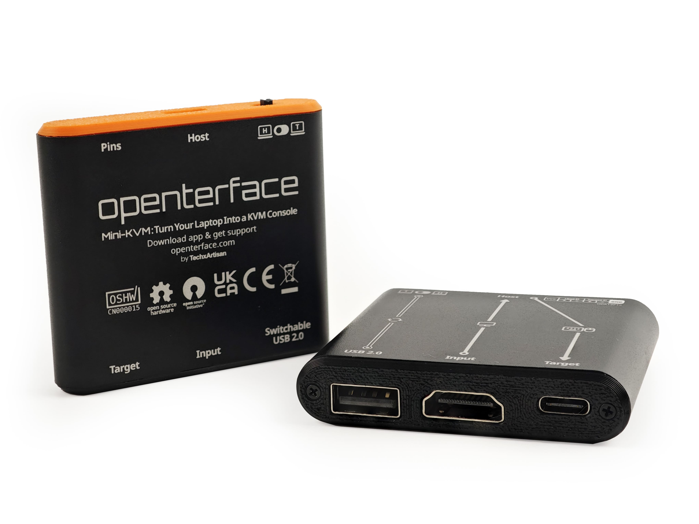

# Schnellstart

{:style="max-height:420px"}

Unser **Openterface™ Mini-KVM** ermöglicht es Ihnen, einen nahegelegenen headless Computer direkt von Ihrem eigenen Laptop oder Desktop aus über USB- und HDMI-Verbindungen zu steuern, wodurch zusätzliche Peripheriegeräte oder Netzwerkverbindungen überflüssig werden. In dieser Dokumentation bezeichnen wir Ihren steuernden Laptop oder Desktop als **Host** ( {:style="height:18px"} {:style="height:15px"} {:style="height:18px"} {:style="height:15px"} ) und das gesteuerte Gerät als **Target** ( {:style="height:18px"} {:style="height:18px"} {:style="height:18px"} {:style="height:18px"}).

-   :material-feature-search-outline:{ .lg .middle } __Funktionen__

    ---

    Entdecken Sie die leistungsstarken Funktionen des Openterface™ Mini-KVM

    [:octicons-arrow-right-24: Funktionen anzeigen](/features)

-   :material-power-plug:{ .lg .middle } __Verbindung herstellen__

    ---

    Richten Sie Ihr Openterface™ Mini-KVM ein und beginnen Sie, Ihr Zielgerät zu steuern

    [:octicons-arrow-right-24: Verbindungsanleitung](/how-to-connect)

-   :material-open-source-initiative:{ .lg .middle } __Host-Apps__

    ---

    Steuern Sie Ihr Zielgerät nahtlos mit unseren benutzerfreundlichen Host-Anwendungen

    [:octicons-arrow-right-24: Host-App herunterladen](/app)

-   :material-chip:{ .lg .middle } __Offene Hardware__

    ---

    Erfahren Sie mehr über unser Engagement für Open-Source-Hardware und Transparenz

    [:octicons-arrow-right-24: Details zur offenen Hardware](/open-hardware)

-   :material-frequently-asked-questions:{ .lg .middle } __Anwendungsfälle & FAQs__

    ---

    Entdecken Sie ideale Einsatzszenarien für Openterface™ Mini-KVM und finden Sie Antworten auf häufig gestellte Fragen

    [:octicons-arrow-right-24: Anwendungsfälle erkunden](/use-cases)
    
    [:octicons-arrow-right-24: FAQs anzeigen](/faq)

-   :material-compare:{ .lg .middle } __Vergleich__

    ---

    Sehen Sie, wie sich Openterface™ Mini-KVM im Vergleich zu anderen KVM-Lösungen schlägt

    [:octicons-arrow-right-24: Warum Openterface?](/why-openterface)

    [:octicons-arrow-right-24: Vergleich anzeigen](/comparison)

