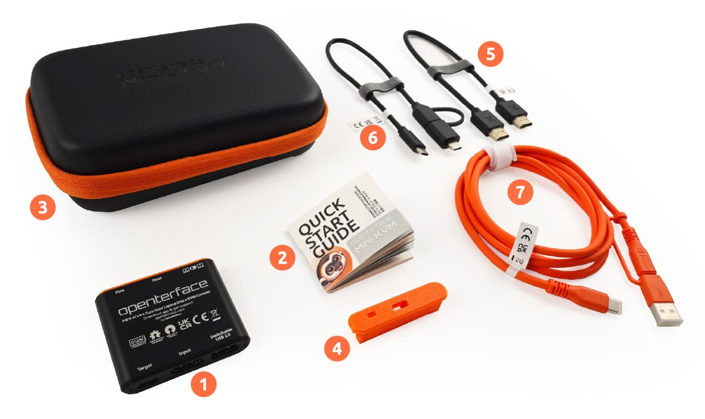

# Was ist in der Box

Entdecken Sie unsere zwei Kaufoptionen, die auf Ihre Bedürfnisse zugeschnitten sind, egal ob Sie nur das Nötigste oder ein komplettes Set an Werkzeugen suchen.

## Paket 1: Basis-Paket

{:style="width:680px"}

1. Kernprodukt: Openterface Mini-KVM
2. Schnellstartanleitung

## Paket 2: Werkzeug-Paket

{:style="width:680px"}

1. Kernprodukt: Openterface Mini-KVM
2. Schnellstartanleitung
3. Werkzeugtasche (165 x 110 x 50mm)
4. Verlängerungskappe
5. HDMI-Kabel (30cm, Stecker zu Stecker)
6. Typ-C-zu-USB-A-Kabel (0.3m) mit USB-A-zu-USB-C-Adapter
7. Typ-C-zu-Typ-C-Kabel (1.5m) mit USB-C-zu-USB-A-Adapter

{:style="width:680px"}